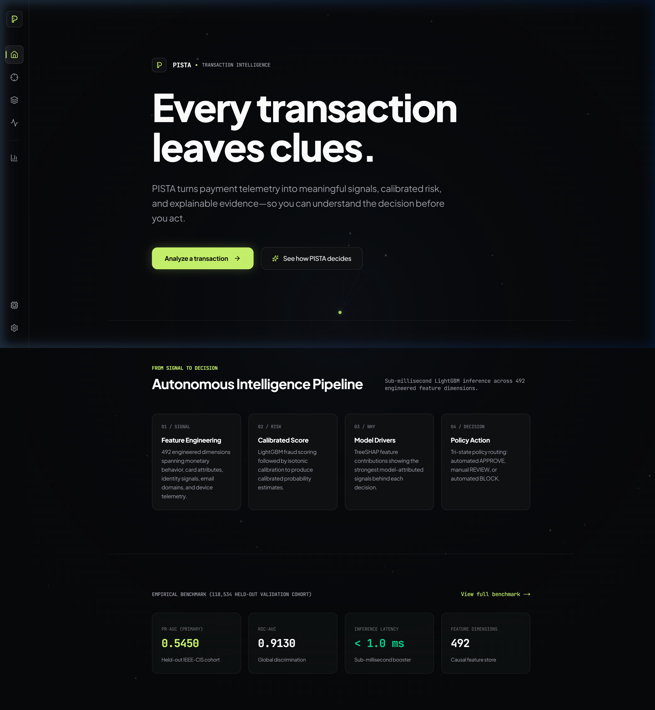
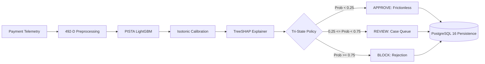
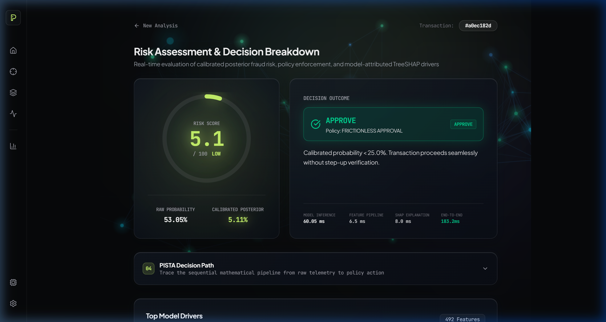
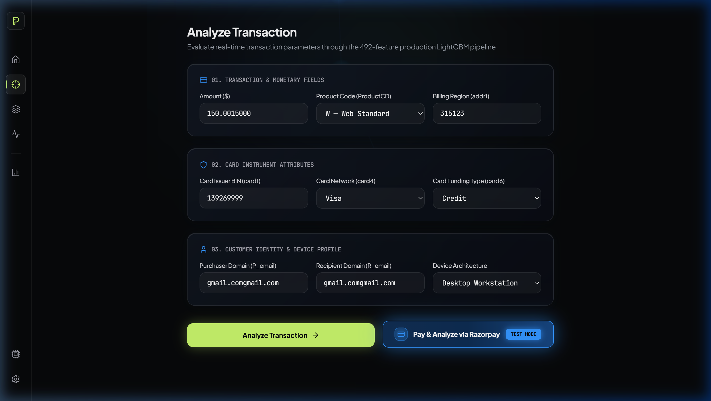
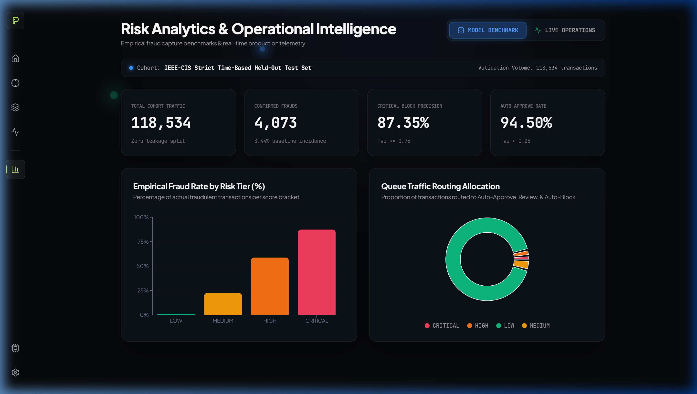
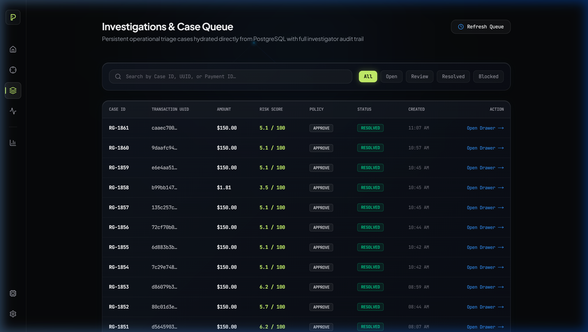
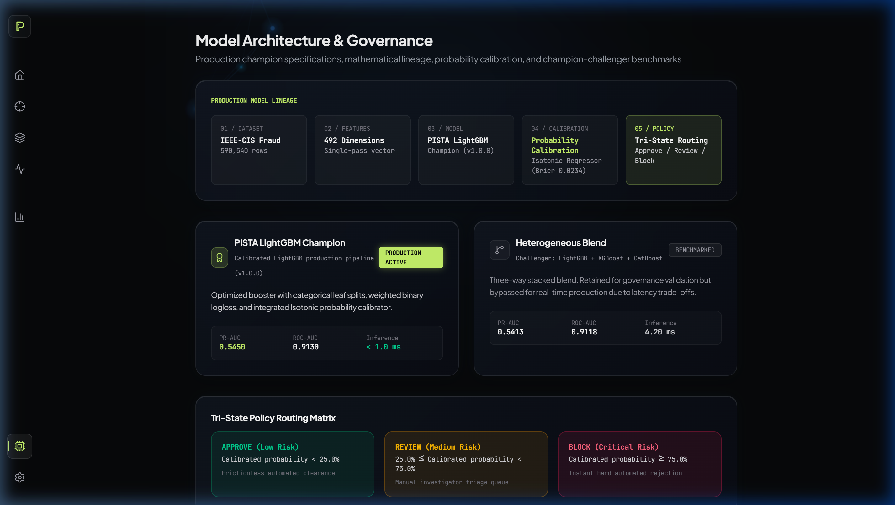
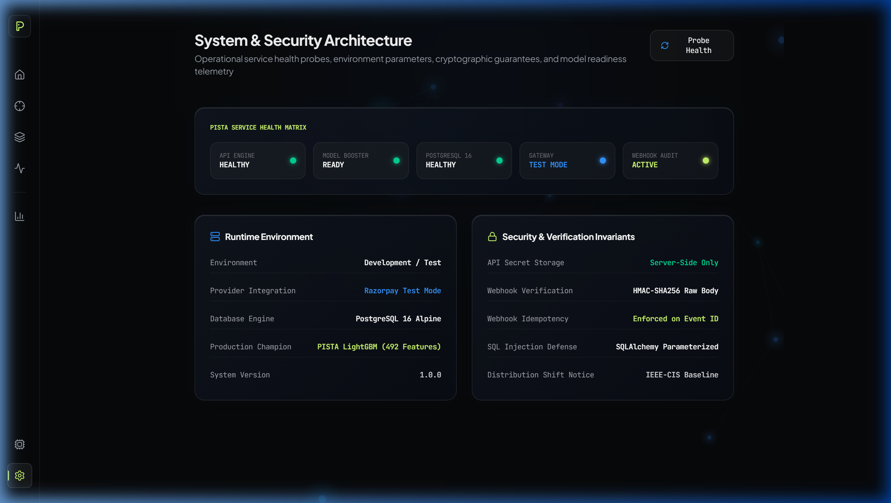

<div align="center">

# ⚡ PISTA — Transaction Intelligence
### *From payment telemetry signals to calibrated, explainable fraud risk decisions in sub-milliseconds.*

[](https://frontend-sigma-vert-50.vercel.app)
[](https://github.com/gautamhardik/PISTA)
[](https://www.python.org/)
[](https://fastapi.tiangolo.com/)
[](https://nextjs.org/)
[](https://lightgbm.readthedocs.io/)
[](https://shap.readthedocs.io/)
[](https://www.postgresql.org/)
[](https://razorpay.com/)
[](file:///c:/Users/hiten/Documents/RP/backend/tests)

<br/>

</div>

---

> ### 📋 Executive Evaluator Brief (15-Second Executive Brief)
> * **Core Problem**: Real-time payment fraud decisioning under extreme class imbalance (3.5% base incidence).
> * **Benchmark Dataset**: IEEE-CIS Fraud Detection (590,540 rows, out-of-time chronological validation split).
> * **Production Champion**: `PISTA LightGBM Champion` (Tuned LightGBM + Isotonic Probability Calibrator).
> * **Feature Space**: **492 engineered dimensions** spanning 10 causal feature families (spending deviations, velocity bursts, composite cards).
> * **Primary Optimization Metric**: **PR-AUC = 0.5450** (Held-out validation cohort of 118,534 transactions).
> * **Calibration Quality**: **ROC-AUC = 0.9130**, **Brier Score = 0.0234** (Isotonic Regression).
> * **Latency Performance**: Model Inference **< 1.0 ms** | End-to-End API Scoring **~40–60 ms** (including local SHAP attribution).
> * **Operational Policy**: Tri-State Operational Routing ($\tau_{\text{review}} = 0.25$, $\tau_{\text{block}} = 0.75$).
> * **Gateway Verification**: Razorpay Standard Checkout Test Mode with raw-byte HMAC-SHA256 signature verification & idempotent webhook store.
> * **End-to-End Reproducibility**: 5-part executable Jupyter notebook suite (`Notebooks/01` to `Notebooks/05`).

---

## 1. Demo & Visual Walkthrough



### Video Demonstration
* **Demonstration Scope**: Real-time transaction analysis, 492-feature inference, TreeSHAP attribution factor breakdown, interactive decision path, Razorpay test mode checkout flow, live PostgreSQL case triage queue with chronological audit logging, and dual-context analytics (118k cohort benchmark vs. live operations).

---

## 2. Executive Summary

PISTA solves the operational disconnect between training a raw machine learning model and executing high-stakes payment decisions in production.

Simply predicting a binary label (`0` or `1`) is insufficient for real-world payment gateways. Gateways require calibrated posterior probabilities, clear model attribution for human investigators, sub-millisecond scoring, and tri-state routing policies that protect merchant revenue without burdening legitimate cardholders.



---

## 3. Problem Statement

Payment fraud is characterized by:
1. **Extreme Class Imbalance**: Fraud accounts for ~3.5% of transactions. Traditional accuracy is misleading.
2. **Uncalibrated Model Scores**: Raw boosting outputs do not equal true mathematical probabilities.
3. **Black-Box Opacity**: Chargeback analysts cannot defend or audit unexplained model scores.
4. **Binary Decision Pitfall**: A single threshold forces a destructive trade-off between false-positive revenue loss and fraud slip-through.

PISTA solves this with **Isotonic Probability Calibration**, **TreeSHAP local factor attribution**, and an operational **Tri-State Routing Policy**.

---

## 4. Why PISTA

| Challenge | Traditional Approach | PISTA Architecture |
| :--- | :--- | :--- |
| **Class Imbalance** | Accuracy / ROC-AUC only | Optimized primarily for **PR-AUC (0.5450)** |
| **Probability Truth** | Uncalibrated sigmoid output | **Isotonic Probability Calibration** ($Brier = 0.0234$) |
| **Explainability** | Black-box score | Local **TreeSHAP** feature contributions |
| **Operational Action** | Binary cutoff ($0.50$) | **Tri-State Routing** ($\tau_{\text{review}} = 0.25$, $\tau_{\text{block}} = 0.75$) |
| **Auditability** | In-memory logs | Immutable **PostgreSQL** case audit events |
| **Model Governance** | Single unbenchmarked model | **Champion / Challenger** lineage tracking |
| **Payment Ingestion** | Synthetic forms only | **Razorpay Gateway** (Test Mode) + HMAC-SHA256 validation |

---

## 5. System Architecture

```mermaid
flowchart TD
    subgraph Client["Presentation Layer (Next.js 16 + Turbopack)"]
        UI_Home["/ (Overview & Hero)"]
        UI_Analyze["/analyze (492-Feature Form & Razorpay)"]
        UI_Result["/result (4-Layer Latency & TreeSHAP)"]
        UI_Cases["/cases (Investigation Queue & Audit Drawer)"]
        UI_Analytics["/analytics (118k Benchmark vs Live Telemetry)"]
        UI_Model["/model (Lineage & Governance)"]
        UI_Settings["/settings (Service Health & Cryptographic Probes)"]
    end

    subgraph API["Backend Service Layer (FastAPI 0.115)"]
        Router_Predict["POST /api/v1/predict"]
        Router_Payments["POST /api/v1/payments/razorpay/*"]
        Router_Cases["GET|PATCH /api/v1/cases/*"]
        Router_Analytics["GET /api/v1/analytics/*"]
        Router_Model["GET /api/v1/model/*"]
        Router_Health["GET /health, /readiness"]
    end

    subgraph CoreML["Machine Learning Engine"]
        Preprocessor["Single-Pass 492-D Vectorizer"]
        Booster["PISTA LightGBM Champion (<1ms)"]
        Calibrator["Isotonic Probability Calibrator"]
        Explainer["TreeSHAP Explainer Pipeline"]
        PolicyEngine["Tri-State Policy Engine"]
    end

    subgraph Data["Persistence Layer (PostgreSQL 16 Alpine)"]
        DB_Tx["transactions (UUID, payload, latency)"]
        DB_Risk["risk_assessments (probabilities, SHAP factors)"]
        DB_Cases["cases (triage state, resolution notes)"]
        DB_Audit["case_audit_logs (actor, previous_status, event)"]
        DB_Webhooks["webhook_events (idempotent event store)"]
    end

    Client --> API
    API --> CoreML
    CoreML --> Data
    API --> Data
```



---

## 6. End-to-End Transaction Flow

1. **Transaction Entry**: The transaction enters via manual telemetry submission or Razorpay test mode checkout.
2. **Payload Validation**: Pydantic schema validates all fields (card attributes, financial amounts, email domains, device metadata).
3. **Feature Engineering**: The vectorizer maps inputs across 492 dimensions, imputing missing features with baseline cohort medians.
4. **Champion Inference**: LightGBM computes the raw booster score in $< 1.0\text{ ms}$.
5. **Probability Calibration**: Isotonic regression calibrates the raw score into a true posterior probability.
6. **TreeSHAP Attribution**: TreeExplainer isolates top positive and negative feature contributions.
7. **Policy Evaluation**: Threshold logic assigns the action (`APPROVE`, `REVIEW`, `BLOCK`).
8. **PostgreSQL Persistence**: Transaction, risk assessment, and investigation cases are committed atomically.
9. **Real-Time Visualization**: The frontend displays the result with a 4-layer latency breakdown and an interactive decision path.

---

## 7. Machine Learning Pipeline & Reproducibility

### Dataset: IEEE-CIS Fraud Detection
* **Total Transactions**: 590,540 rows.
* **Feature Dimensions**: 394 raw columns expanded to 492 engineered features.
* **Evaluation Strategy**: Chronological out-of-time validation split (training on earlier periods, validating on the final 118,534 transactions to prevent temporal leakage).

---

## 8. Reproducible Notebook Suite

The complete ML pipeline is fully reproducible through the sequential Jupyter notebooks in the [`Notebooks/`](Notebooks) directory:

| Notebook | Focus | Key Methodology | Primary Output Artifact |
| :--- | :--- | :--- | :--- |
| **`01_data_understanding_and_eda.ipynb`** | Forensic EDA & Data Understanding | Transaction amount distributions, missingness patterns, identity presence risk analysis | Exploratory figures & data-quality summary |
| **`02_feature_engineering_and_risk_representation.ipynb`** | 492-D Causal Feature Store | 10 feature families: expanding historical stats, rolling windows, card entity velocity, email domain mismatches | `val_features.parquet`, `train_features.parquet` |
| **`03_baseline_fraud_modeling_and_benchmarking.ipynb`** | Multi-Model Benchmarking & Tuning | Logistic Regression, Random Forest, LightGBM, XGBoost, CatBoost, Heterogeneous Blend | `baseline_lightgbm.joblib` |
| **`04_model_evaluation_threshold_optimization.ipynb`** | Calibration & Threshold Optimization | Isotonic Regression calibration, cost-curve optimization ($C_{\text{FN}}$ vs $C_{\text{FP}}$), Tri-State Policy | `calibration_model.joblib`, `decision_policy_config.json` |
| **`05_model_explainability_and_risk_decisioning.ipynb`** | TreeSHAP Explainability & Triage | Local/Global SHAP values, beeswarm visualizations, error case studies, risk score scaling | Model governance cards & feature schemas |

### Reproduction Commands
```bash
# 1. Clone repository and navigate to workspace
git clone https://github.com/gautamhardik/PISTA.git
cd PISTA

# 2. Set up Python virtual environment
python -m venv venv
source venv/bin/activate  # On Windows: venv\Scripts\activate

# 3. Install core ML dependencies
pip install -r backend/requirements.txt jupyter polars pyarrow

# 4. Execute notebooks in sequence
jupyter nbconvert --to notebook --execute Notebooks/01_data_understanding_and_eda.ipynb
jupyter nbconvert --to notebook --execute Notebooks/02_feature_engineering_and_risk_representation.ipynb
jupyter nbconvert --to notebook --execute Notebooks/03_baseline_fraud_modeling_and_benchmarking.ipynb
jupyter nbconvert --to notebook --execute Notebooks/04_model_evaluation_threshold_optimization.ipynb
jupyter nbconvert --to notebook --execute Notebooks/05_model_explainability_and_risk_decisioning.ipynb
```

---

## 9. Feature Engineering (10 Core Families)

```text
492 Engineered Features
├── 01. Financial Scaling (log1p, cents fraction, round amount flags)
├── 02. Temporal Dynamics (sin/cos diurnal cycles, relative elapsed hours)
├── 03. Card Entity Aggregations (card1-addr1 composite keys, expanding frequencies)
├── 04. Historical Spending Deviations (expanding mean, variance, z-scores)
├── 05. Velocity & Burst Signals (time-since-previous-tx, 10-minute bursts)
├── 06. Identity Completeness (presence flags, device attribute counts)
├── 07. Domain Discrepancy Signals (purchaser vs. recipient domain mismatch)
├── 08. Entity Graph Connectivity (distinct address/device counts per card)
├── 09. Causal Rolling Windows (1-hour & 24-hour transaction sums)
└── 10. Provider Data Alignment (defaults for unobserved signals)
```

---

## 10. Model Evaluation & Benchmark Results

### Held-Out Validation Cohort (118,534 Transactions)

| Candidate Model | PR-AUC (Primary) | ROC-AUC | Inference Latency | Production Status |
| :--- | :---: | :---: | :---: | :---: |
| **PISTA LightGBM Champion** | **0.5450** | **0.9130** | **< 1.0 ms** | 🟢 **ACTIVE CHAMPION** |
| Heterogeneous Stacked Blend | 0.5413 | 0.9151 | 4.20 ms | ⚪ Benchmarked Challenger |
| Tuned XGBoost | 0.5382 | 0.9084 | 2.80 ms | ⚪ Evaluated |
| CatBoost Classifier | 0.5310 | 0.9022 | 5.10 ms | ⚪ Evaluated |
| Random Forest Baseline | 0.4620 | 0.8640 | 12.5 ms | ⚪ Baseline |
| Logistic Regression | 0.2840 | 0.7720 | 0.40 ms | ⚪ Linear Baseline |

> **Why LightGBM Won**: Achieved highest PR-AUC (**0.5450**) while maintaining **< 1.0 ms** inference latency and native categorical handling, outperforming the heavy 3-model blend in real-time throughput.

---

## 11. Model Calibration & Explainability

### Probability Calibration
Raw boosting scores are uncalibrated due to class imbalance. PISTA passes scores through an **Isotonic Calibrator** ($Brier = 0.0234$), producing genuine posterior probabilities for policy thresholds.

### TreeSHAP Attribution
TreeSHAP computes exact local additive feature attributions for every prediction, identifying:
* **Top Risk Amplifiers** (e.g. high velocity bursts, domain mismatches, unverified identity).
* **Top Trust Mitigators** (e.g. established card history, matching billing domains).

---

## 12. Tri-State Policy Matrix

| Calibrated Probability | Decision | Operational Routing |
| :--- | :---: | :--- |
| **$P < 25.0\%$** | **`APPROVE`** | Instant frictionless clearance. Zero customer friction. |
| **$25.0\% \le P < 75.0\%$** | **`REVIEW`** | Routed to investigator queue for manual triage. |
| **$P \ge 75.0\%$** | **`BLOCK`** | Immediate hard rejection to prevent chargeback loss. |

---

## 13. Application Walkthrough

### 01. Transaction Risk Evaluation
Submit 492-feature parameters directly or run test payment checkouts.



---

### 02. Razorpay Gateway Test Mode Integration
Simulate authentic payment authorization with server-side HMAC-SHA256 signature verification.



---

### 03. Operational Analytics & Model Benchmarks
Empirical fraud capture breakdown on the 118,534 cohort alongside real-time live telemetry.



---

### 04. Investigations & Case Audit Trail
Persistent operational triage queue hydrated from PostgreSQL with resolution logging.



---

### 05. Model Lineage & Governance
Model lineage from IEEE-CIS dataset to production champion metrics.



---

### 06. System Health & Security Matrix
Runtime health probes, environment parameters, and cryptographic invariants.



---

## 14. Security & Cryptographic Invariants

* **Server-Side API Secrets**: Razorpay key secrets are never exposed to the client.
* **HMAC-SHA256 Signature Verification**: Payment payloads are cryptographically verified using raw request bodies.
* **Webhook Idempotency**: Webhook events are deduplicated against the `webhook_events` PostgreSQL table.
* **Parameterized Queries**: All database queries utilize SQLAlchemy ORM parameterization.

---

## 15. Key API Endpoints

| Method | Route | Description |
| :--- | :--- | :--- |
| `POST` | `/api/v1/predict` | Executes single-pass 492-D feature vectorization, LightGBM inference, calibration, and TreeSHAP attribution. |
| `POST` | `/api/v1/payments/razorpay/order` | Generates a Razorpay Test Mode order. |
| `POST` | `/api/v1/payments/razorpay/verify` | Verifies HMAC-SHA256 signature and triggers fraud assessment. |
| `GET` | `/api/v1/cases` | Retrieves triage cases hydrated from PostgreSQL. |
| `GET` | `/api/v1/cases/{case_id}/audit` | Retrieves chronological audit event history for a case. |
| `PATCH`| `/api/v1/cases/{case_id}/status` | Updates case triage state and writes an immutable audit record. |
| `GET` | `/api/v1/analytics/summary` | Returns offline 118k validation cohort benchmark metrics. |
| `GET` | `/api/v1/analytics/live` | Returns live PostgreSQL operational telemetry (P50/P95 latency, counts). |
| `GET` | `/health`, `/readiness` | Probes container liveness and ML model memory load status. |

---

## 16. Tech Stack

| Layer | Technology | Purpose |
| :--- | :--- | :--- |
| **Frontend** | Next.js 16 (App Router), React 19, Tailwind CSS 4, Recharts, Framer Motion | High-performance spatial transaction UI |
| **Backend** | FastAPI 0.115, Pydantic v2, Uvicorn | Asynchronous REST API engine |
| **ML Engine** | LightGBM, Scikit-Learn (Isotonic), TreeSHAP | Model inference, calibration, and attribution |
| **Data Processing**| Polars, NumPy, Pandas | Fast feature transformation and store operations |
| **Database** | PostgreSQL 16 Alpine, SQLAlchemy 2.0 | Persistent operational store and audit logging |
| **Payment Gateway**| Razorpay API (Test Mode) | Live gateway payment verification |
| **Containerization**| Docker, Docker Compose | Multi-container orchestration |

---

## 17. Local Setup & Execution Guide

> **Frontend (UI only)** is live publicly at **[https://frontend-sigma-vert-50.vercel.app](https://frontend-sigma-vert-50.vercel.app)** — no setup required to view all 8 routes.
>
> **Full end-to-end** (ML inference + Razorpay + PostgreSQL) requires the local Docker stack below.

### Prerequisites
* [Docker Desktop](https://www.docker.com/products/docker-desktop/) installed and running.
* Git installed.

### One-Command Production Launch
```bash
# 1. Clone the repository
git clone https://github.com/gautamhardik/PISTA.git
cd PISTA

# 2. Launch all 3 production containers (PostgreSQL + FastAPI + Next.js)
docker compose up --build -d

# 3. Verify all containers are healthy
docker compose ps
```

Expected output — all three containers healthy:
```
NAME              STATUS
pista-postgres    Up (healthy)
pista-backend     Up (healthy)
pista-frontend    Up
```

| Service | URL | Description |
|---------|-----|-------------|
| **Frontend** | http://localhost:3000 | Full PISTA dashboard |
| **Backend API** | http://localhost:8000/docs | Interactive Swagger UI |
| **Health Check** | http://localhost:8000/health | Backend liveness probe |
| **PostgreSQL** | localhost:5432 | `pista_db`, user `pista_user` |

---

## 18. Evaluator Quick Start (Step-by-Step Test Drive)

1. Open **[http://localhost:3000/analyze](http://localhost:3000/analyze)**.
2. Click **`02. High Risk Vector ($4,850)`** preset, then click **Analyze Transaction**.
3. View the **Evaluation Result** page: verify the **4-Layer Latency breakdown**, the **TreeSHAP model drivers**, and the **Decision Path**.
4. Open **[http://localhost:3000/cases](http://localhost:3000/cases)**: click the flagged transaction, add an investigator note, and click **Resolve as Legitimate**. Verify the audit timeline updates.
5. Open **[http://localhost:3000/analytics](http://localhost:3000/analytics)**: inspect the 118k cohort validation charts vs. the Live Operations tab.

---

## 19. Project Structure

```text
PISTA/
│
├── README.md                          # Master single-file documentation & walkthrough
├── docker-compose.yml                 # Multi-container orchestration (Postgres + Backend + Frontend)
├── .gitignore                         # Security & dataset exclusion rules
├── .env.example                       # Environment configuration template
│
├── Notebooks/                         # Complete 5-Notebook ML Pipeline
│   ├── 01_data_understanding_and_eda.ipynb
│   ├── 02_feature_engineering_and_risk_representation.ipynb
│   ├── 03_baseline_fraud_modeling_and_benchmarking.ipynb
│   ├── 04_model_evaluation_threshold_optimization.ipynb
│   └── 05_model_explainability_and_risk_decisioning.ipynb
│
├── backend/                           # FastAPI REST Engine
│   ├── app/                           # Core routes, services, schemas, and DB models
│   ├── artifacts/                     # Production champion & benchmark challenger
│   ├── tests/                         # Automated unit & integration test suites
│   ├── requirements.txt               # Complete Python dependencies
│   └── Dockerfile
│
├── frontend/                          # Next.js 16 Spatial UI
│   ├── src/                           # 8 core routes, visual components, layout
│   ├── package.json
│   └── Dockerfile
│
├── docs/                              # Visual showcase assets
│   └── images/
│
└── Data/                              # Dataset acquisition guide
    └── README.md
```

---

## 20. Reproducibility Checklist

- [x] **Dataset Guide Available**: Documented in [`Data/README.md`](file:///c:/Users/hiten/Documents/RP/Data/README.md).
- [x] **Notebook 01 Executed**: EDA, distributions, missingness patterns, and identity availability analysis.
- [x] **Notebook 02 Executed**: 492-feature causal engineering across 10 families.
- [x] **Notebook 03 Executed**: Multi-model benchmarking (LightGBM, XGBoost, CatBoost, Blend).
- [x] **Notebook 04 Executed**: Isotonic probability calibration & tri-state threshold sweeps.
- [x] **Notebook 05 Executed**: TreeSHAP feature contributions & risk scoring.
- [x] **Champion Exported**: Production artifacts saved in `backend/artifacts/champion/`.
- [x] **Backend Tests Passing**: 12/12 pytest unit and integration tests passing.
- [x] **Docker Stack Active**: Orchestrated multi-container build running locally.

---

## 21. Limitations & Production Considerations

* **Distribution Shift**: Live transactions generated outside IEEE-CIS data distributions are normalized with imputed reference baselines.
* **Test Mode Gateway**: Razorpay integration is currently configured for Test Mode; live money transfer requires merchant KYC and live key exchange.
* **Observability**: Production enterprise deployment would benefit from streaming drift monitors (e.g. Evidently AI) and automated weekly recalibration pipelines.

---

## 22. Conclusion

PISTA demonstrates that transaction fraud prevention requires more than just training a classifier—it requires a complete operational system spanning **rigorous feature engineering**, **sub-millisecond inference**, **calibrated posterior probabilities**, **interpretable model attribution**, **tri-state policy execution**, and **immutable audit logging**.
